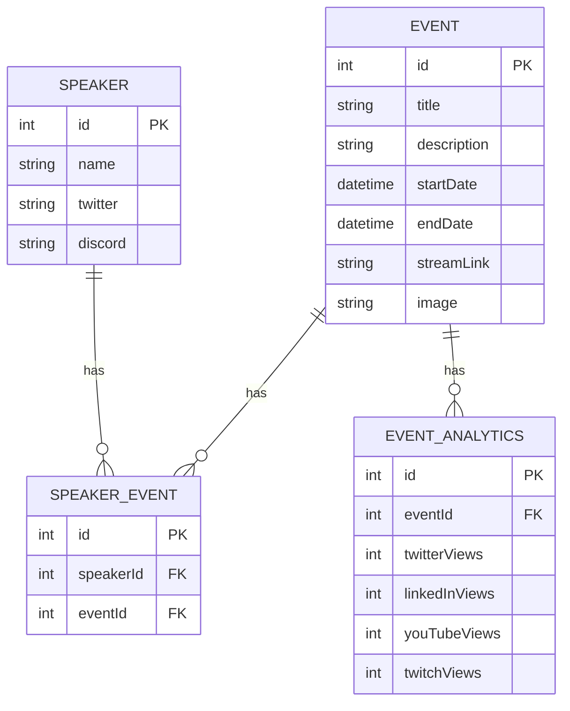

```mermaid
erDiagram
    SPEAKER {
        int id PK
        string name
        string twitter
        string discord
    }

    EVENT {
        int id PK
        string title
        string description
        datetime startDate
        datetime endDate
        string streamLink
        string image
    }

    SPEAKER_EVENT {
        int id PK
        int speakerId FK
        int eventId FK
    }

    EVENT_ANALYTICS {
        int id PK
        int eventId FK
        int twitterViews
        int linkedInViews
        int youTubeViews
        int twitchViews
    }

    SPEAKER ||--o{ SPEAKER_EVENT : has
    EVENT ||--o{ SPEAKER_EVENT : has
    EVENT ||--o{ EVENT_ANALYTICS : has

```
